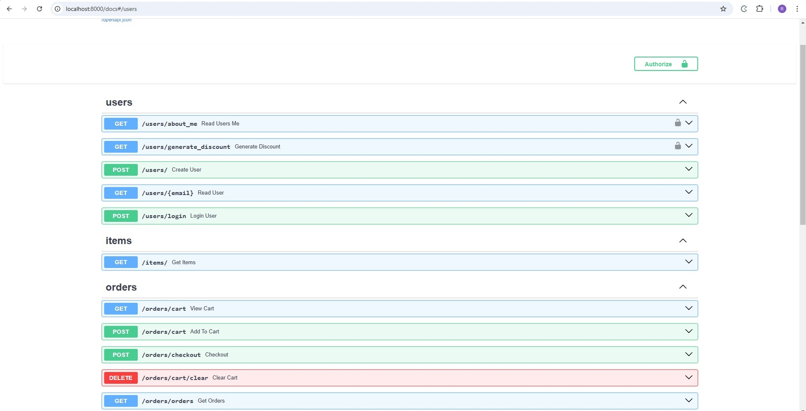

### Fastapi Discount Api
---
This is ecommerce module where customer can add items in order and then check out and applied coupon if valid.

### Run Manually.
---   
1. Set up .env file with following keys.Set value as per your requirements
````
SECRET_KEY=xxxx #this is for encryption of token
````
2. Install dependenceny   
````
pip install -r requirements.txt
````
3. Run the below command to start fastapi
````
uvicorn main:app --reload
````
4. You can see api swagger here [http://127.0.0.1:8000/docs](http://127.0.0.1:8000/docs)

### Run with Docker
1. clone this repo
2. Go to project in terminal   
3. Run follwing command to start docker with application
``` docker-compose up ``` Or ``` docker-compose up -d ```
4. You can visit fastapi docs from [backend](http://127.0.0.1:8000/docs)

### Testing
1. clone this repo
2. Go to project in terminal
3. Install dependenceny   
````
pip install -r requirements.txt
````
4. Run below command to run test cases.
````
pytest
````


[Postman Collection](api_postman_collection.json)